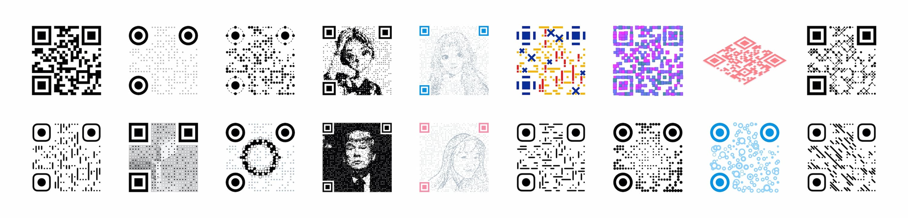

<h1 align="center">QRBTF</h1>

    Website: <a href="https://qrbtf.com" target="_blank">qrbtf.com</a>
    | <a href="https://discord.gg/V9CNuqYfte" target="_blank">Discord server</a>

    The world's first and best AI & parametric QR code generator.
    By <a href="https://latentcat.com" target="_blank">Latent Cat</a>.

    
    

## News

- **03/19/2024** 
  The website has been completely rebuilt using Next.js, integrating AI and parametric parts, supporting English and Chinese, SSR, and lazy loading components. Contributions to i18n in other languages are welcome!

## Features

- **AI part**
  - Original models trained on a large number of images.
  - Extremely fast and high quality inference.
- **Parametric part**
  - Open source.
  - Various styles with no backend required.
  - Support for SVG format.

Articles:

- [如何制作一个漂亮的二维码 (Chinese)](https://mp.weixin.qq.com/s/_Oy9I9FqPXhfwN9IUhf6_g)
- [AI 生成可扫码图像 — 新 ControlNet 模型展示 (Chinese)](https://mp.weixin.qq.com/s/i4WR5ULH1ZZYl8Watf3EPw)
- [ControlNet for QR Code](https://www.reddit.com/r/StableDiffusion/comments/141hg9x/controlnet_for_qr_code/)

## Usage

1. Open [qrbtf.com](https://qrbtf.com).
2. Enter a URL or text.
3. Select a style.
4. Adjust parameters.
5. Download for `SVG` `JPG` or `SVG` format.

## React Component

See [CPunisher / react-qrbtf](https://github.com/cpunisher/react-qrbtf) for more information.

## Authors

- [ciaochaos](https://github.com/ciaochaos)
- [CPunisher](https://github.com/CPunisher)
- More members at [Latent Cat](https://latentcat.com).

## Contact

- [E-mail](mailto://contact@latentcat.com) for cooperation consultation.
- [Discord server](https://discord.gg/V9CNuqYfte) for community communication and support.

## License

[GNU General Public License v3.0](LICENSE)
