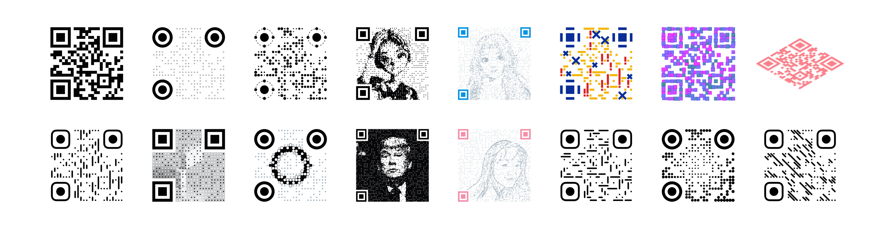

<h1 align="center"></h1>

<p align="center">
    URL: <a href="https://qrbtf.com" rel="noopener noreferrer" target="_blank">qrbtf.com</a><br />
    QRBTF is a simple web app to beautify your QR code.
</p>

<p align="center">
    
</p>

## Features

* Various Art QR Code Styles
* Parametric Design
* No Backend Required
* Support for SVG Downloads

中文介绍: 

* [如何制作一个漂亮的二维码](https://mp.weixin.qq.com/s/_Oy9I9FqPXhfwN9IUhf6_g)
* [QRBTF 开源啦！来写个二维码样式吧～](https://mp.weixin.qq.com/s/GFEMCWQu3e2qhTuBabnHmQ)

## QRBTF Website

### Installation

``` bash
git clone https://github.com/ciaochaos/qrbtf.git
cd qrbtf
npm install
npm start
```

### Usage

1. Open [qrbtf.com](https://qrbtf.com).
2. Enter a URL or text.
3. Select a style.
4. Adjust parameters.
5. Download `JPG` or `SVG`.

## React Component (react-qrbtf)

See [CPunisher / react-qrbtf](https://github.com/cpunisher/react-qrbtf) for more information.

``` bash
npm install react-qrbtf --save
```

### Include the Component

```js
import React from 'react'
import { QRNormal } from 'react-qrbtf'

class Component extends React.Component {

    render() {
        return (
            <QRNormal
                value="react-qrbtf"
                className="my-qrcode"
                styles={{ svg: {width: "200px"} }}
                type="round"
                size={50}
                opacity={80}
                posType="planet"
                otherColor="#33CCCC"
                posColor="#009999"
            />
        )
    }
}
```

## Third-Party Project

* [gexin1 / beautify-qrcode](https://github.com/gexin1/beautify-qrcode)

## Author

* [ciaochaos](https://github.com/ciaochaos)
* [CPunisher](https://github.com/CPunisher)

## Donation

#### Paypal

[](https://www.paypal.me/ciaochaos)

#### Alipay


## Dependency

* [davidshimjs / qrcode](https://github.com/davidshimjs/qrcodejs)
* [cozmo / jsQR](https://github.com/cozmo/jsQR)

## License

[GPLv3](LICENSE)
